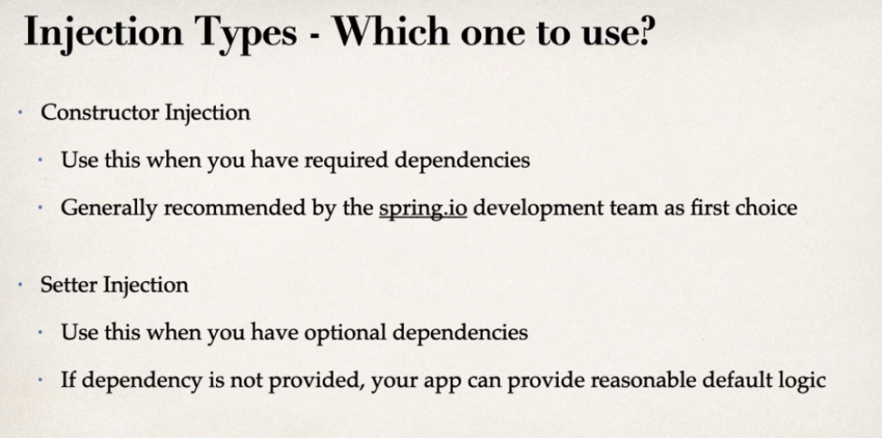

### SPRING BOOT HANDBOOK WITH PHUQUOCCHAMP

#### COURSES LINKS

- [[NEW] Master Spring Boot 3 &amp; Spring Framework 6 with Java](https://iqbusiness.udemy.com/course/spring-boot-and-spring-framework-tutorial-for-beginners/)
- [[NEW] Spring Boot 3, Spring 6 &amp; Hibernate for Beginners](https://iqbusiness.udemy.com/course/spring-hibernate-tutorial/)

#### Một số nội dung cần nắm:

##### Spring & Spring Boot

Spring boot là một framework sử dụng spring behind the sence (việc sử dụng spring boot sẽ giúp cho ta cấu hình, sử dụng spring một cách nhanh chóng và dễ dành hơn)

##### Spring Core

###### IOC (Inversion Of Control)

###### Dependency Injection

- Contructor injection
- Settter injection.
- When we use these type

  

###### Spring bean


Trong Spring Framework, một **bean** là một đối tượng được quản lý bởi Spring Container. Bean đại diện cho các thành phần cụ thể của ứng dụng, chẳng hạn như các đối tượng Java (POJO), các thành phần được quản lý (managed components), hay các service. Các bean được tạo, cấu hình và quản lý bởi Spring Container, và chúng thường được sử dụng để triển khai các logic kinh doanh và các chức năng khác của ứng dụng.

Dưới đây là một số điểm quan trọng về Spring bean:

1. **Định nghĩa Bean**:

   - Bạn có thể định nghĩa bean bằng cách sử dụng các annotations như `@Component`, `@Service`, `@Repository`, `@Controller`, hoặc bằng cách sử dụng XML configuration.
2. **Cấu hình Bean trong XML**:

   - Trong cấu hình XML, bạn có thể sử dụng thẻ `<bean>` để định nghĩa bean. Ví dụ:
     ```xml
     <bean id="myBean" class="com.example.MyBean"/>
     ```
3. **Dependency Injection (DI)**:

   - Spring cung cấp các cơ chế Dependency Injection để inject các dependency vào bean. Dependency có thể được inject qua constructor, setter method, hoặc field.
4. **Scope của Bean**:

   - Scope xác định "phạm vi" hoặc "thời gian sống" của một bean. Các scope phổ biến bao gồm singleton (một bean duy nhất), prototype (mỗi lần yêu cầu bean tạo một instance mới), request, session, và global session.
5. **Initialization và Destruction Callbacks**:

   - Bạn có thể định nghĩa các phương thức để thực hiện các công việc initialization và destruction khi bean được tạo và khi nó bị hủy.

Dưới đây là một ví dụ đơn giản về cách sử dụng annotations để định nghĩa và cấu hình một bean:

```java
import org.springframework.stereotype.Component;

@Component  // Đánh dấu là một Spring bean
public class MyBean {
    // Các logic của bean
}
```

Trong trường hợp này, `MyBean` là một Spring bean, và khi bạn sử dụng `@ComponentScan` hoặc cấu hình tương tự, Spring Container sẽ tự động quét và đăng ký bean này. Sau đó, bạn có thể inject nó vào các thành phần khác trong ứng dụng của mình.

###### Spring Container

Trong Spring Framework, một **Spring Container** là một môi trường chứa và quản lý các thành phần (components) của ứng dụng, chẳng hạn như các đối tượng (beans) và các thành phần khác. Container chịu trách nhiệm khởi tạo, cấu hình và quản lý vòng đời của các đối tượng trong ứng dụng.

Có hai loại container chính trong Spring:

1. **BeanFactory Container**: Đây là container cơ bản nhất. Nó thực hiện nhiệm vụ cơ bản của một container, bao gồm quản lý vòng đời của các bean và cung cấp các tính năng cơ bản như dependency injection. BeanFactory Container được sử dụng chủ yếu cho các ứng dụng có yêu cầu tài nguyên hạn chế và muốn tối ưu hóa việc sử dụng bộ nhớ.
2. **ApplicationContext Container**: Đây là một mức cao hơn của BeanFactory Container và cung cấp nhiều tính năng mở rộng. ApplicationContext cung cấp các tính năng như sự kiện (events), quản lý transaction, quản lý security, quản lý các property files, quản lý internationalization, và nhiều tính năng khác. ApplicationContext được sử dụng phổ biến hơn trong các ứng dụng do độ mạnh mẽ và khả năng tích hợp nhiều tính năng.

Cách mà bạn khai báo và cấu hình các bean được quản lý bởi container thường là thông qua các annotation (`@Component`, `@Service`, `@Repository`, `@Controller`,...) hoặc thông qua cấu hình XML.

Dưới đây là một ví dụ đơn giản về cách bạn có thể sử dụng ApplicationContext Container trong Spring:

```java
import org.springframework.context.ApplicationContext;
import org.springframework.context.annotation.AnnotationConfigApplicationContext;

public class MyApp {
    public static void main(String[] args) {
        // Tạo và cấu hình ApplicationContext từ class cấu hình
        ApplicationContext context = new AnnotationConfigApplicationContext(AppConfig.class);

        // Lấy bean từ container
        MyService myService = context.getBean(MyService.class);

        // Sử dụng bean
        myService.doSomething();
    }
}
```

Trong ví dụ trên, `AppConfig` là một class cấu hình của Spring, được đánh dấu bằng `@Configuration`, và nó chứa các định nghĩa bean. `AnnotationConfigApplicationContext` được sử dụng để tạo ApplicationContext từ cấu hình thông qua các annotation. Sau đó, bạn có thể lấy các bean từ container và sử dụng chúng trong ứng dụng của mình.

###### Component Scan

Trong Spring Framework, `@ComponentScan` là một annotation được sử dụng để chỉ định các package mà Spring Container nên quét để tìm các bean cần đăng ký. Khi bạn đánh dấu một package với `@ComponentScan`, Spring sẽ tự động tìm kiếm các class được đánh dấu với các annotations như `@Component`, `@Service`, `@Repository`, `@Controller`, và các annotations khác. Sau đó, nó sẽ tạo và đăng ký các bean tương ứng trong container.

Ví dụ, giả sử bạn có một ứng dụng Spring và bạn muốn quét package `com.example` để tìm và đăng ký các bean. Bạn có thể sử dụng `@ComponentScan` như sau:

```java
@Configuration
@ComponentScan("com.example")
public class AppConfig {
    // Các cài đặt khác của ứng dụng
}
```

Trong ví dụ trên:

- `@Configuration`: Đánh dấu một class là một cấu hình của Spring.
- `@ComponentScan("com.example")`: Chỉ định package mà Spring nên quét để tìm các bean.

Khi ứng dụng được khởi chạy, Spring sẽ tự động quét các class trong package `com.example` và các sub-packages của nó để tìm và đăng ký các bean.

Ngoài ra, bạn cũng có thể chỉ định nhiều packages hoặc sử dụng thuộc tính `basePackages` để chỉ định một danh sách các packages.

```java
@Configuration
@ComponentScan(basePackages = {"com.example.package1", "com.example.package2"})
public class AppConfig {
    // Các cài đặt khác của ứng dụng
}
```

Điều này giúp quản lý và tổ chức mã nguồn của bạn, đồng thời giúp Spring tự động quét và đăng ký các bean mà không cần phải thêm cấu hình rườm rà.

##### Annotation

###### **@Qualifier**

Trong Spring Framework, `@Qualifier` là một annotation được sử dụng để chỉ định tên của một bean cụ thể mà bạn muốn inject vào một dependency. Điều này là cần thiết khi có nhiều bean cùng loại được đăng ký trong container Spring và bạn muốn chỉ rõ bean nào sẽ được sử dụng.

Ví dụ, giả sử bạn có một interface `Person` và hai implementation của nó là `Student` và `Teacher`. Nếu bạn có một dependency kiểu `Person` và có nhiều bean cùng kiểu được đăng ký, bạn có thể sử dụng `@Qualifier` để xác định bean cụ thể mà bạn muốn sử dụng.

```java
public interface Person {
    // ...
}

@Component("studentBean")
public class Student implements Person {
    // ...
}

@Component("teacherBean")
public class Teacher implements Person {
    // ...
}

@Component
public class SomeClass {

    private final Person person;

    @Autowired
    public SomeClass(@Qualifier("studentBean") Person person) {
        this.person = person;
    }

    // ...
}
```

Trong ví dụ trên, `@Qualifier("studentBean")` được sử dụng để chỉ rõ rằng bạn muốn inject bean có tên là "studentBean" vào trường `person` của class `SomeClass`. Điều này giúp Spring biết được bean cụ thể nào cần được sử dụng khi có nhiều bean cùng kiểu được đăng ký.

###### @Primary

Trong Spring Framework, `@Primary` là một annotation được sử dụng để chỉ định rằng khi có nhiều bean cùng loại được đăng ký trong container, bean được đánh dấu là `@Primary` sẽ được ưu tiên chọn để inject.

Ví dụ, giả sử bạn có một interface `MessageService` và có nhiều implementation của nó. Bạn muốn một bean cụ thể được chọn mặc định khi có nhiều bean cùng loại. Bạn có thể sử dụng `@Primary` để làm điều này.

```java
public interface MessageService {
    String getMessage();
}

@Component
public class EmailService implements MessageService {
    @Override
    public String getMessage() {
        return "Email message";
    }
}

@Component
@Primary  // Đánh dấu là bean mặc định khi có nhiều bean cùng loại
public class SmsService implements MessageService {
    @Override
    public String getMessage() {
        return "SMS message";
    }
}
```

Trong ví dụ trên, `SmsService` được đánh dấu là `@Primary`, vì vậy khi bạn inject một bean của kiểu `MessageService` mà không chỉ định tên hoặc `@Qualifier`, Spring sẽ tự động chọn `SmsService` làm bean mặc định.

```java
@Service
public class MyService {
    private final MessageService messageService;

    // @Primary bean (SmsService) sẽ được inject tự động
    public MyService(MessageService messageService) {
        this.messageService = messageService;
    }
}
```

Nếu có nhiều bean cùng kiểu và không có `@Primary`, bạn có thể sử dụng `@Qualifier` để chỉ định rõ tên của bean bạn muốn inject.
