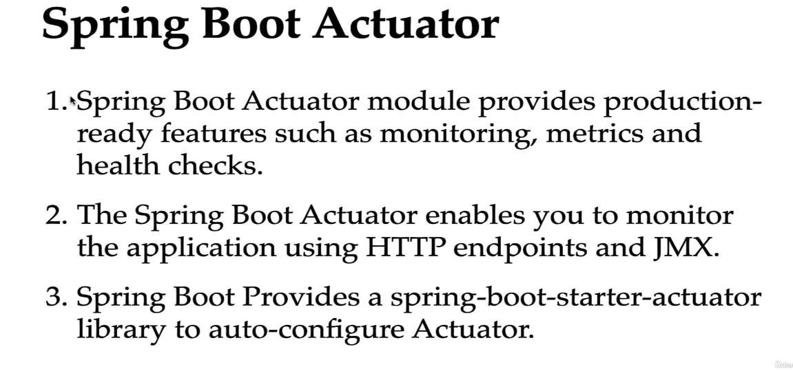

### 200 DAYS TO BECOME A JAVA DEV | DAY 07/200.

#### SPRING BOOT ACTUATOR

##### Tutorial Guider



**Config application.properties**

```properties
management.endpoints.web.exposure.include=*
```

> properties trên dùng để config spring boot actuator .

###### /info


**Config**

> management.info.env.enabled=true dùng để enable info actuator.

```properties
management.info.env.enabled=true

info.app.name = Spring Boot RestApi Webservices
info.app.description = This is a RestApi Webservices
info.app.version = 1.0

```

**Output**


###### /health


**Config**

```properties
# /health config
management.endpoint.health.show-details=always

```

**Output**


###### /bean


###### /conditions


###### /mappings


###### /configprops


###### /matrics


###### /env


###### /loggers


###### /shutdown


#### RESTAPI DOCMENTATION

[RESTful API Document Tạo với Spring Boot + Swagger](https://loda.me/articles/sb24-restful-api-document-tao-voi-spring-boot-swagger)

##### Tutoial Guider


###### Define General API Information

> Add this annotation in spring boot app

```properties
@OpenAPIDefinition(
        info = @Info(
                title = "Spring Boot REST API Documentation",
                description = "Spring Boot REST API Documentation",
                version = "v1.0",
                contact = @Contact(
                        name = "phuquocchamp",
                        email = "phuquocchamp@gmail.com",
                        url = "phuquoccchamp.blogs.vn"
                ),
                license = @License(
                        name = "Apache 2.0",
                        url = "phuquochamp.blogs.vn"
                )
        ),
        externalDocs = @ExternalDocumentation(
                description = "Spring Boot User Management Documentation",
                url = "https://github.com/phuquocchamp/spring-boot-handbook"
        )
)
```


###### Customize Swagger API Document

**Config**


**Output**


#### TODO MANAGEMENT PROJECT

##### Requirement 1


###### Database Config

```properties
spring.datasource.url=jdbc:mysql://localhost:3306/todo_management
spring.datasource.username=testuser
spring.datasource.password=user@12345
spring.jpa.hibernate.ddl-auto=update

spring.jpa.properties.hibernate.dialect = org.hibernate.dialect.MySQLDialect

spring.jpa.show-sql=true
spring.jpa.properties.hibernate.format_sql=true

```

> **Trong spring.jpa.hibernate.ddl-auto=?**

- none: The default for MySQL. We make no change to the database structure.
- update: Hibernate changes the database according to the entity structures.
- create: Creates the database every time but does not drop it on close.
- create-drop: Creates the database and drops it when SessionFactory closes.

> **spring.jpa.properties.hibernate.dialect = org.hibernate.dialect.MySQLDialect ?**

-> The SQL dialect makes Hibernate generate better SQL for the chosen database

##### Requirement 2


