### 200 DAYS TO BECOME A JAVA DEV | DAY 08/200

[Code Demo](https://github.com/phuquocchamp/todo-management)

#### SPRING SECURITY

[1) Tìm Hiểu Vể Spring Secuity](https://kungfutech.edu.vn/bai-viet/spring-boot/tim-hieu-ve-spring-security)

##### Tutorial Guider

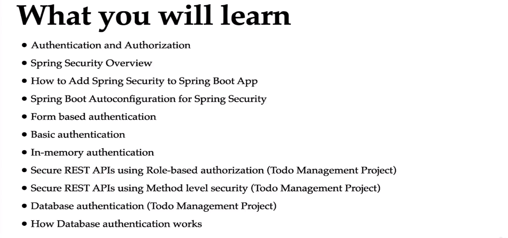

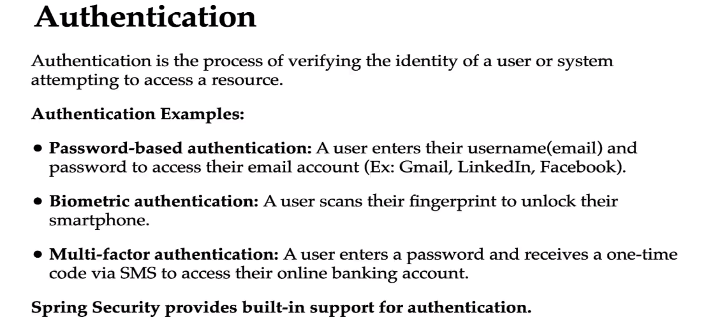

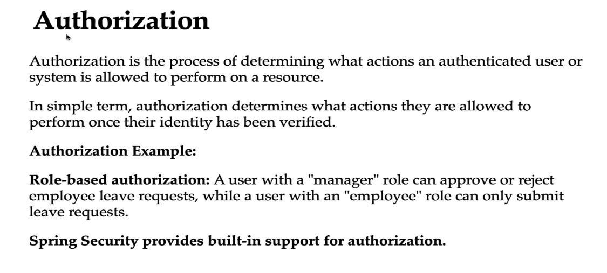

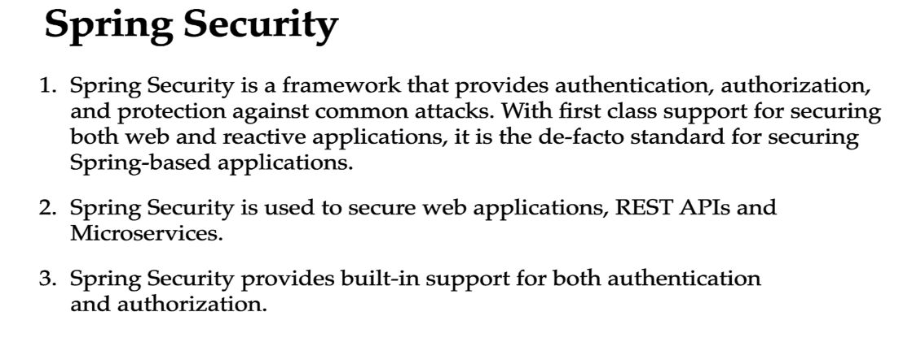

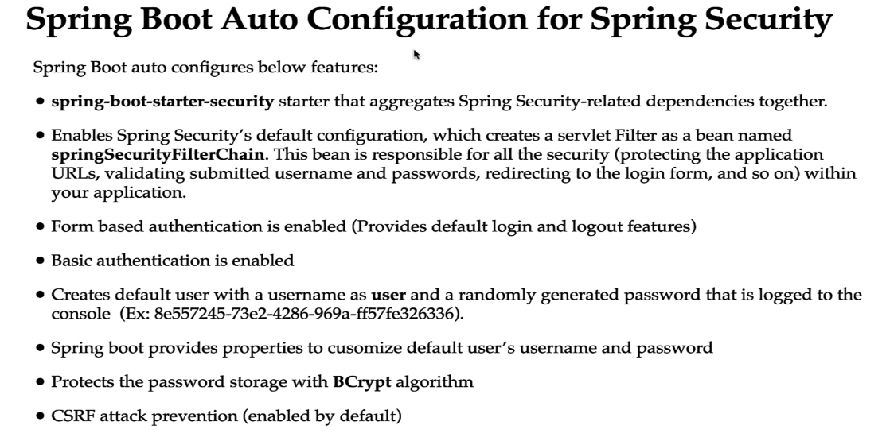

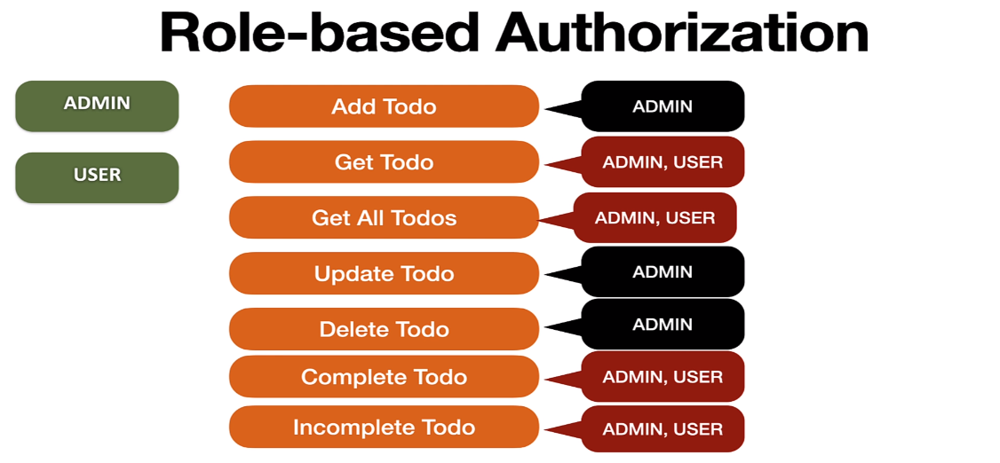

###### Authorization (Phân quyền) - Role Based Authorization

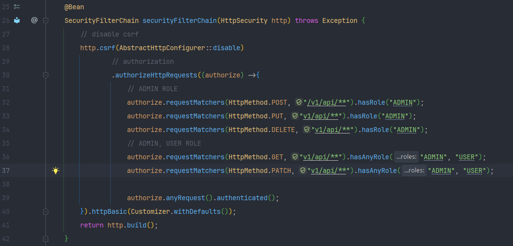

###### Method Level Security

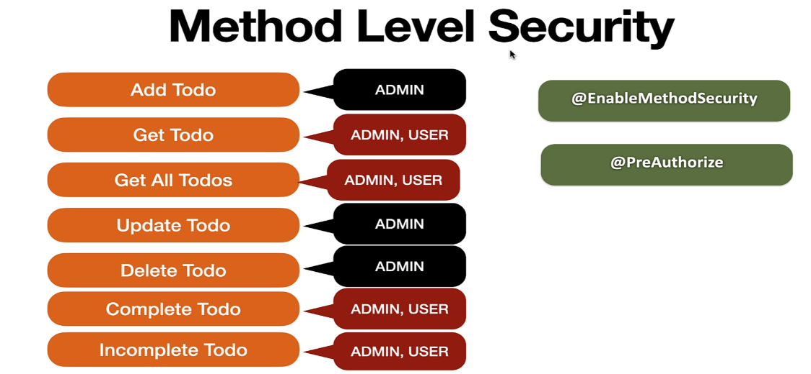

> Với Method Level Security ta sẽ config role trên từng method trong controller

**Thêm annotation @EnableMethodSecurity trong class SpringSecurityConfig**

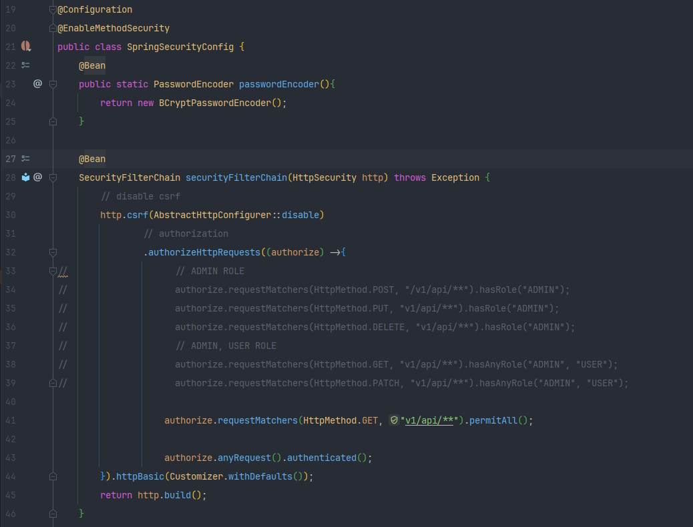

**Config method role trên từng method**

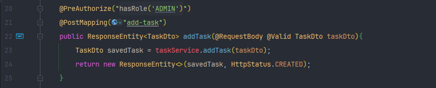

###### Database Authentication Flow

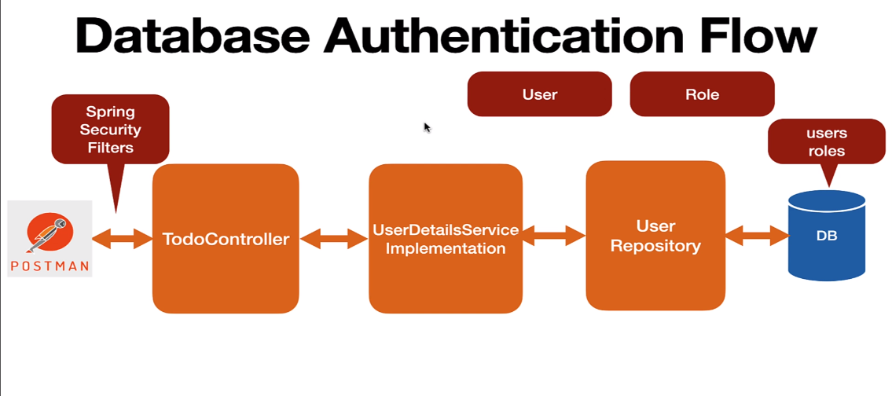

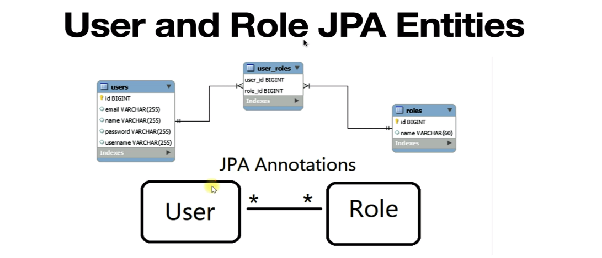

###### How Database Authentication Works

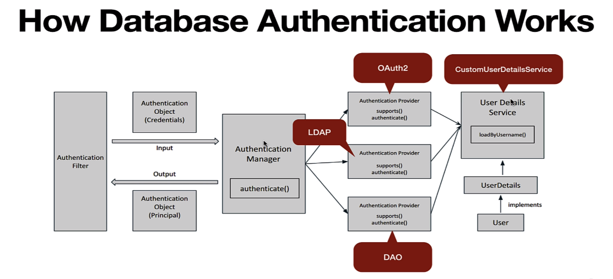
