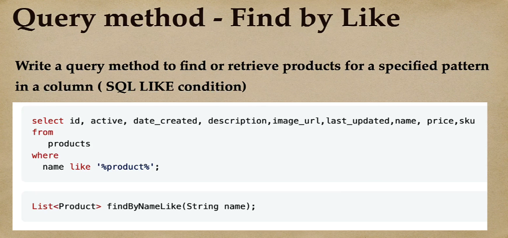

### 200 DAYS TO BECOME A JAVA DEV | DAY 09/200

#### TRANSACTION MANAGEMENT

[Code Demo](https://github.com/phuquocchamp/place-order-management)

##### Tutorial Guider

###### Transaction là gì?

Transaction quản lý những thay đổi mà bạn thực hiện trong một hoặc nhiều hệ thống, nó có thể database, message brokers, hoặc bất kỳ loại hệ thống phần mềm nào khác. Mục tiêu chính của giao dịch là cung cấp các đặc điểm ACID để đảm bảo tính nhất quán và hợp lệ của dữ liệu của bạn.

###### ACID transactions

Vốn dĩ một transaction được đặc trưng bởi 4 yếu tố (thường được gọi là ACID):

* Atomicity quy định rằng tất cả các hoạt động của transaction hoặc là thực thi thành công hết hoặc là không có bất cứ hành động nào được thực khi có bất kỳ một hoạt động thực thi không thành công.
* Consistency nghĩa là tất cả các ràng buộc toàn vẹn dữ liệu(constraints, key, data types, Trigger, Check) phải được thực thi thành công cho mọi transaction phát sinh xuống database, nhầm đảm bảo tính đúng đắn của dữ liệu.
* Isolation đảm bảo các transaction xảy ra xen kẽ sẽ không làm ảnh hưởng đến tính nhất quán của dữ liệu. Các thay đổi dữ liệu bên trong mỗi transaction sẽ được cô lập, các transaction khác sẽ không thể nhìn thấy cho đến khi nó được đồng bộ xuống database.
* Durability đảm bảo một transaction thực thi thành công thì tất cả những thay đổi trong transaction phải được đồng bộ xuống database kể cả khi hệ thống xảy ra lỗi hoặc bị mất điện.

> Mặc định khi ta sử dụng các chức năng CRUD cơ bản (có sẵn) trong Spring JPA thì annotation @Transactional đã được thêm ở các method này.

**@Transactional Annotation trong class implement của interface JpaRepository**

**Nhưng sẽ có những trường hợp ta sẽ phải tự custom method để sử lí (cần transaction)**

> Khi xử lí save object từ các bảng nối (kinh nghiệm)

###### Khi nào nên sử dụng Transaction

> Transaction trong spring boot thường được sử dụng khi ta muốn lưu dữ liệu vào database mà phải thực hiện 2 quá trình (như trong ví dụ trên) thì khi sảy ra lỗi (exception) ở giữa thì data ở bảng 1 vẫn được lưu trong database.
>
> Trong trường hợp này : điều kiện xảy ra đúng khi và chỉ khi dữ liệu được lưu vào 2 bảng thành công hoặc không có bản ghi (record) được lưu vào 2 bảng.

#### Real Time Search REST API

> Khi ta luớt web ta sẽ gặp các api có định dạng như này

##### Tutorial Guider

###### JPQL là gì ?

JPQL là viết tắt của Java Persistence Query Language. Đây là một ngôn ngữ truy vấn dành cho JPA (Java Persistence API), một phần của Java EE và Java SE, được sử dụng để quản lý và tương tác với cơ sở dữ liệu trong các ứng dụng Java.

JPQL cung cấp cú pháp để tạo các truy vấn dựa trên đối tượng (object-based) đến các đối tượng được lưu trữ trong cơ sở dữ liệu. Trong JPQL, bạn truy vấn dữ liệu dựa trên cấu trúc của đối tượng thay vì trên cấu trúc của bảng trong cơ sở dữ liệu.

**Sử dụng JPQL trong hibernate với annotation @Query**

#### SPRING JPA ADVANCED

> Custom query method

##### Tutorial Guider

###### Rules

###### Optional ?

> Optional là một lớp trong Java được giới thiệu từ phiên bản Java 8, được sử dụng để xử lý các trường hợp mà giá trị của một biến có thể null. Optional giúp tránh được các lỗi NullPointerException trong quá trình xử lý dữ liệu.
>
> Khi nào nên sử dụng Optional ? : Khi ta sử dụng các method findBy ... trong JPA thì nên sử dụng Optional để tránh object truy vấn bị null.

###### Find by single filed name

###### Find by multiple filed names

>  Một số lưu ý khi sử dụng **Find by multiple filed names:**
>
> **- findByNameOrDesciption** sẽ tìm record dựa vào so sánh chính xác giá trị của field **Name** hoặc filed **Description.**
>
> 
>
> **- findByNameAndDesciption** sẽ tìm record dựa vào so sánh chính xác giá trị của field **Name** và filed **Description.**
>
> 

###### Distinct

###### Greater Than

###### Containing

###### Like

###### Between

###### Between (Date Range)

###### In

###### Limit Query

