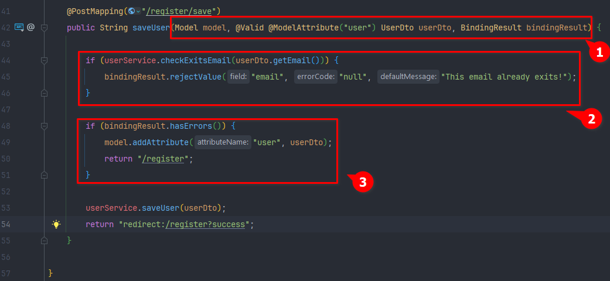

### 200 DAYS TO BECOME A JAVA DEV | DAY 12/200

#### SPRING SECURITY - REGISTRATION & LOGIN PAGE

##### Tutorial Guider

##### Entity

###### Role.class

###### User.class

###### Thymeleaf Data Transfer

**Enpoint /register**

> Ta tạo một đối tượng userDto và thêm vào phần view register, đối tượng này sẽ được binding và nhận các giá trị (thuộc tính) từ  form khi người dùng nhập.

**Xử lí form trong thymeleaf.**

> Ta cần quan tâm đên một số attributes quan trọng khi xử  form.
>
> 1. th:action : Đây là một attribute dùng để điều hướng đến URL Enpoint xử lí form khi click vào button Submit (3).
> 2. th:object : Đây là object được binding từ lớp controller và object này sẽ được dùng để truyền vào Enpoint được khai báo trong th:action="@{/register/save}"

**Enpoint "/register/save"**

> @ModelAttribute("user") UserDto userDto : đây là một annotation dùng để binding dữ liệu từ object có tên "user"  từ  View sang Controller.

###### Thymeleaf Param enpoint

**Enpoint**

**register.html**

**UI**

###### Validation Form 

**Result**

**UserDto** 

> Thêm các Annotation Validation cho các field 

**AuthController**

> 1. Ta sử dụng các annotation như @Valid để check validation cho các trường của lớp UserDto.
> 2. Ta sử dụng lớp DataBinding để lưu các kết quả (lỗi) khi xử lí validation.

**register.html**

> Ta sử dụng th:errors="*{firstName}" để trả về lỗi cho trường firstName khi có lỗi xảy ra.
>
> th:if="${#fields.hasErrors('firstName')}" sẽ check lỗi cho trường firstName.

###### Spring Security

**SecurityConfig**

> Ta có thể viết ngắn gọn như dưới thay vì 

**login.html**

> Ta lưu ý rằng trong 2 thẻ input khi customize trang login thì attribute "name", "id" dùng để spring boot lấy giá trị nên không đc bỏ qua. 

