### 200 DAYS TO BECOME A JAVA DEV | DAY 14/200

#### MICROSERVICES

##### Tutorial Guider

###### Monolith Architechture

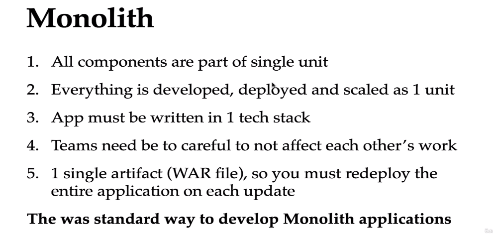

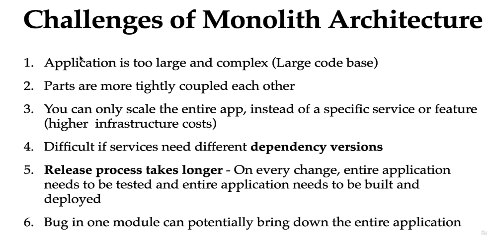

Microservices Architechture

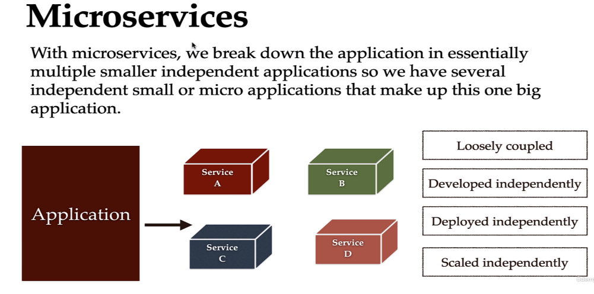

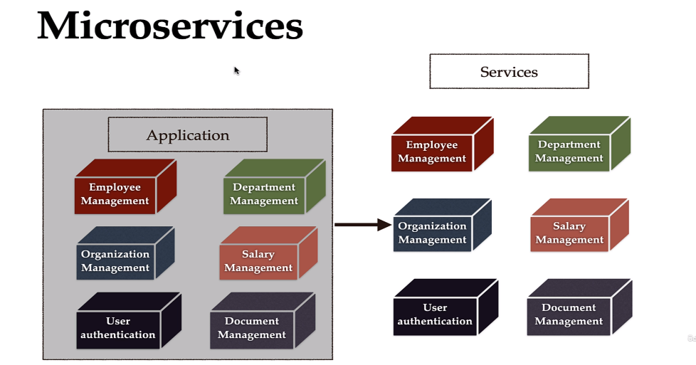

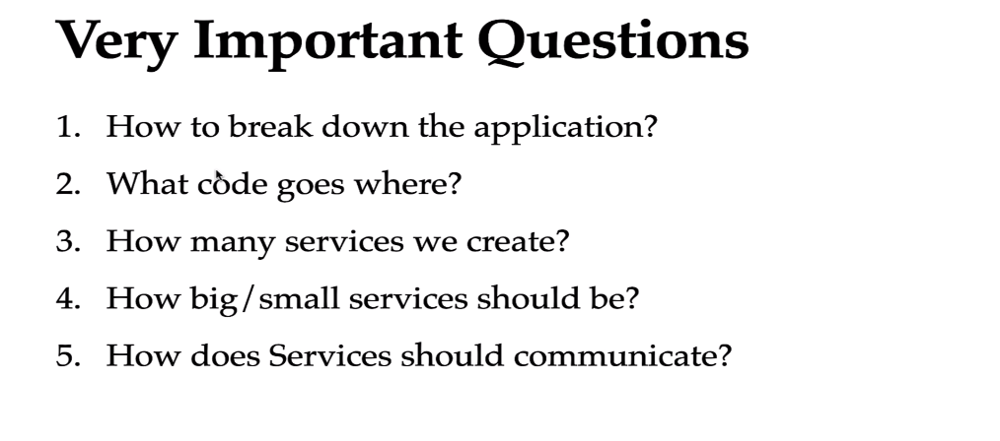

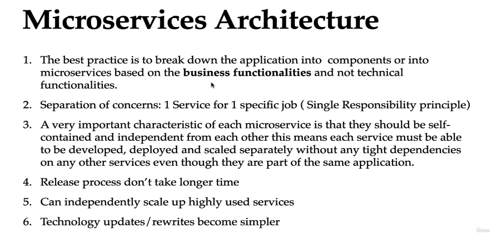

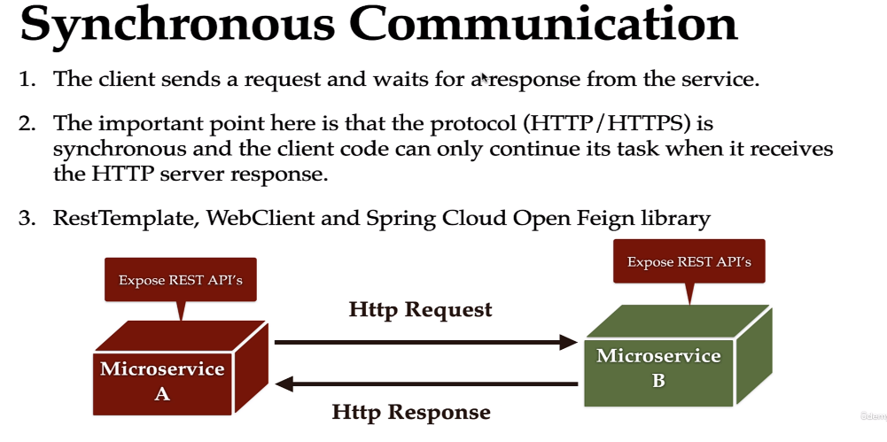

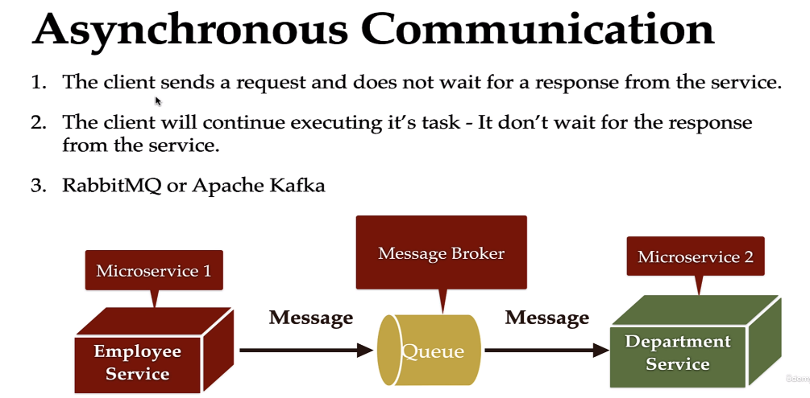

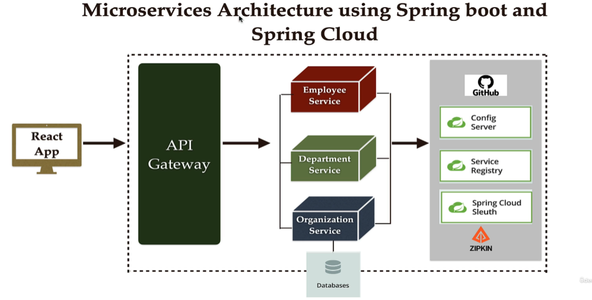

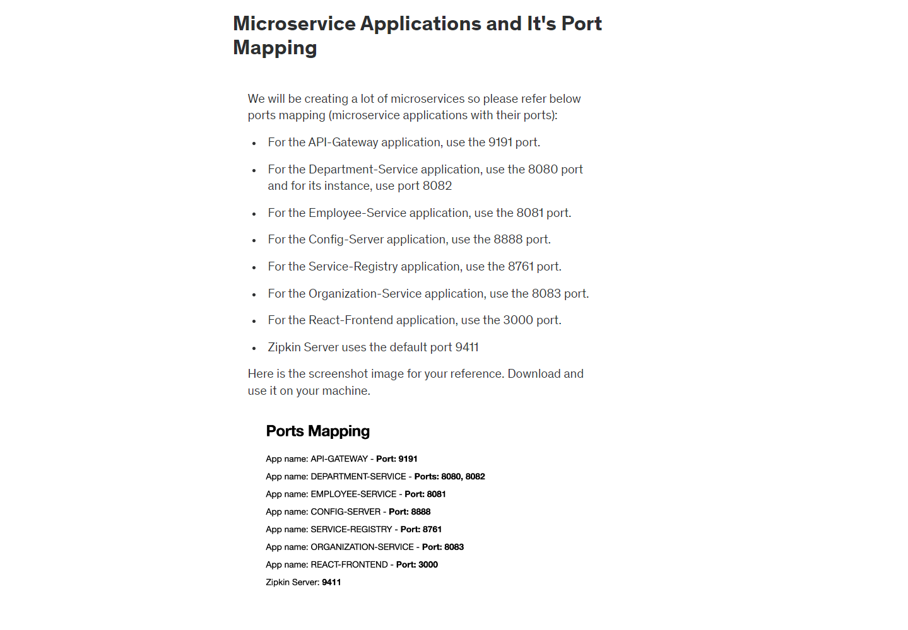

###### Employee Service & Department Service

###### Microservices Communication

>  Khi ta làm việc với các services thì việc giao tiếp để lấy dữ liệu giữa các service cần được thực hiện theo các cách sau: 

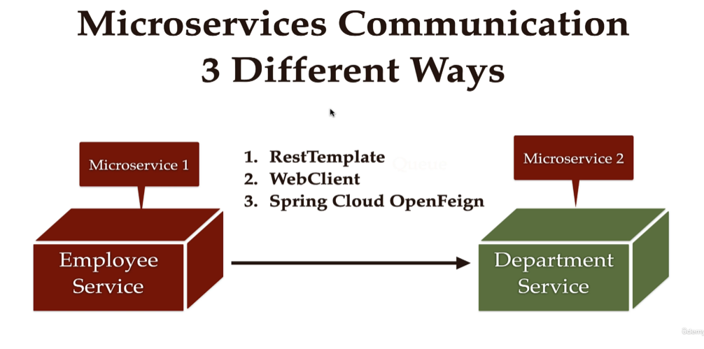

###### RestTemplate --> Không khuyến khích sử dụng.

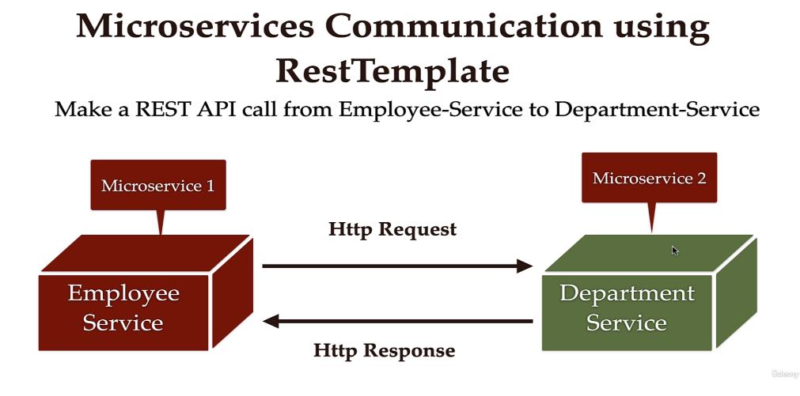

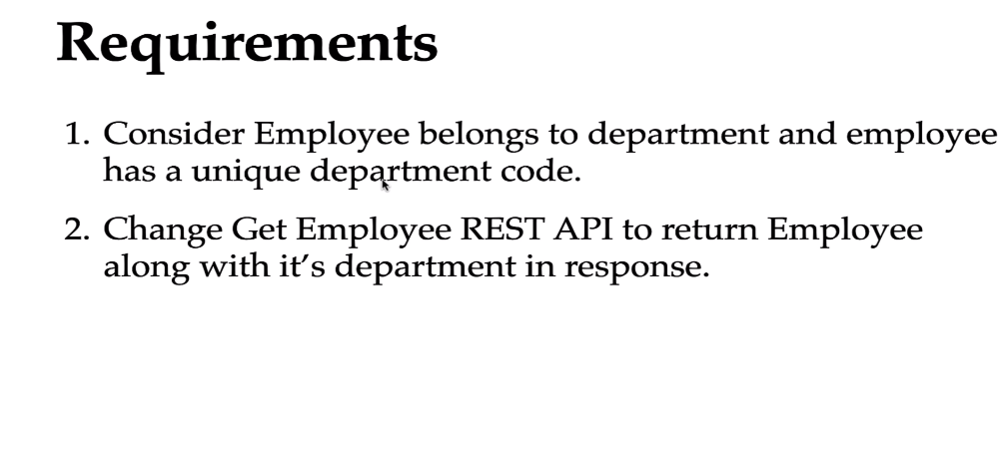

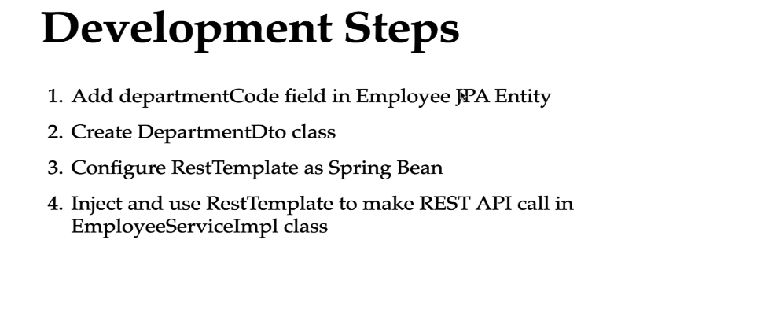

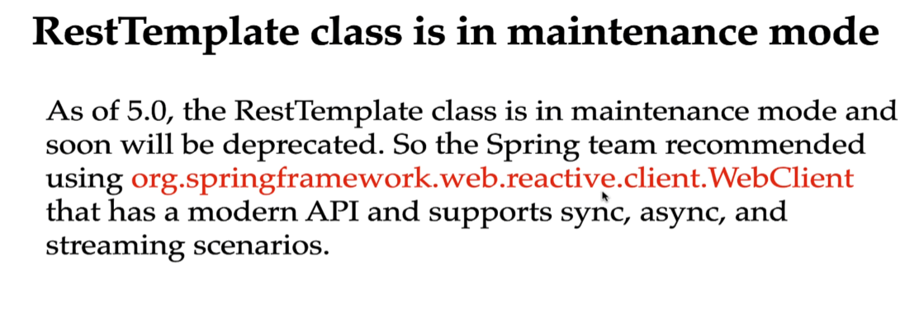

###### WebClient

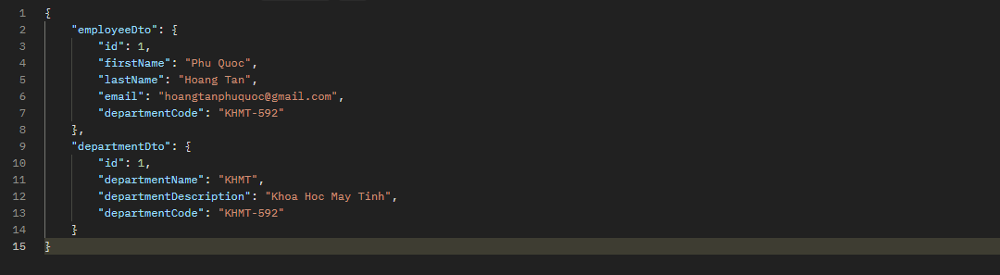

**WebClient Bean**

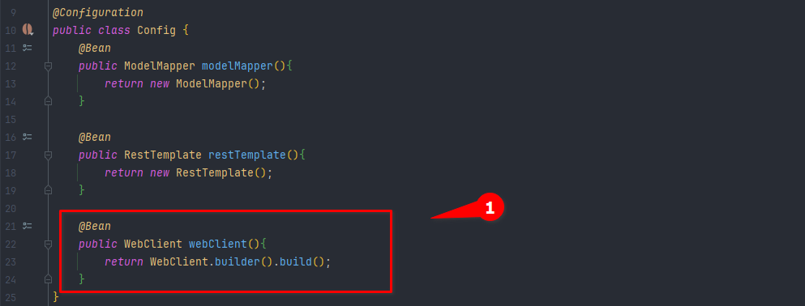

**EmployeeServiceImpl.class**

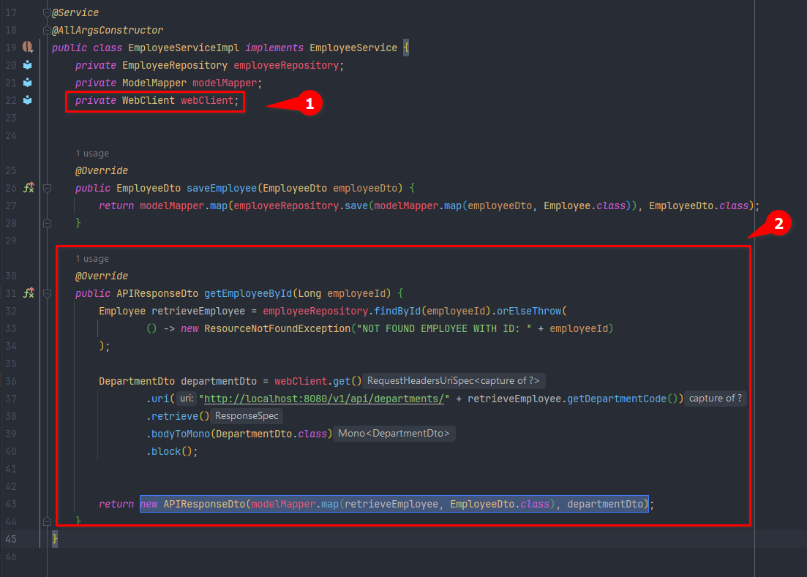

###### Spring Cloud

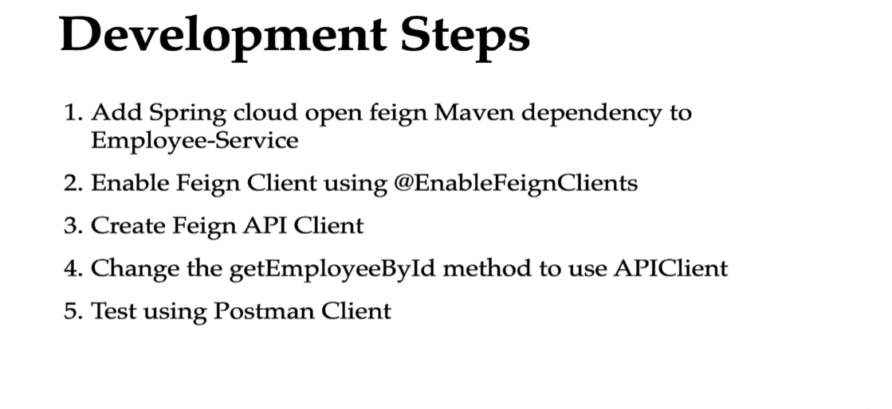

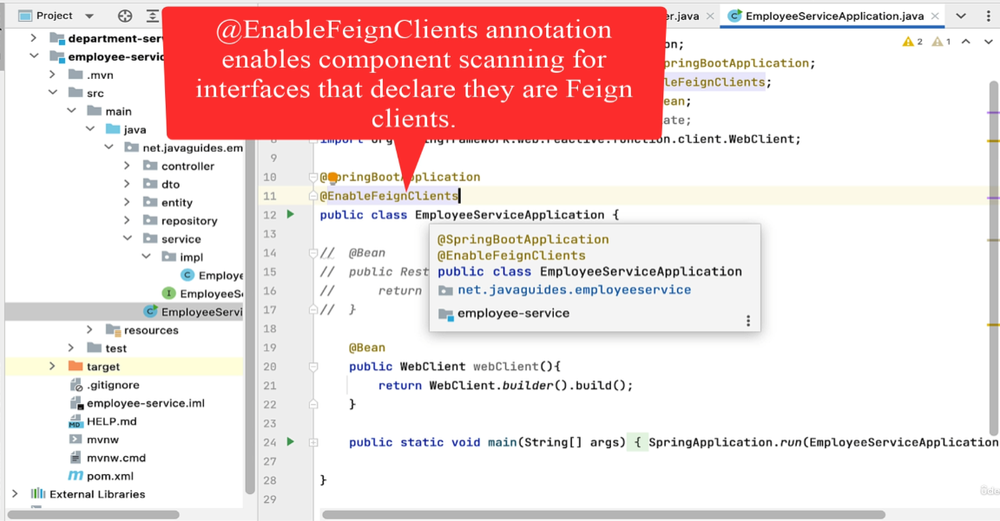

**APIClient interface**

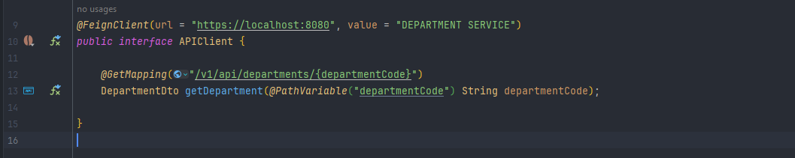
