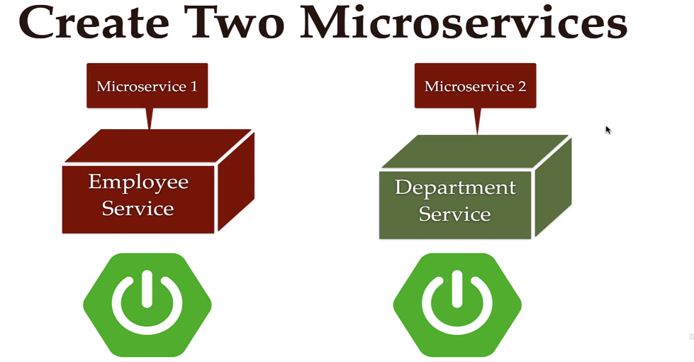

### 200 DAYS TO BECOME A JAVA DEV | DAY 14/200

#### MICROSERVICES

##### Tutorial Guider

###### Monolith Architechture

Microservices Architechture

###### Employee Service & Department Service

###### Microservices Communication

