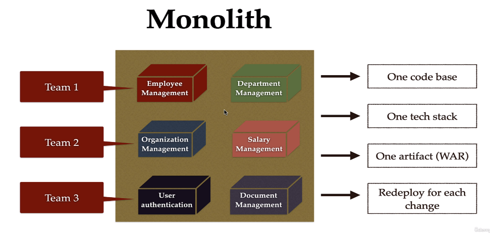

### 200 DAYS TO BECOME A JAVA DEV | DAY 14/200

#### MICROSERVICES

##### Tutorial Guider

###### Monolith Architechture

Microservices Architechture

###### Employee Service & Department Service

###### Microservices Communication

>  Khi ta làm việc với các services thì việc giao tiếp để lấy dữ liệu giữa các service cần được thực hiện theo các cách sau: 

###### RestTemplate --> Không khuyến khích sử dụng.

###### WebClient

**WebClient Bean**

**EmployeeServiceImpl.class**

###### Spring Cloud

**APIClient interface**

