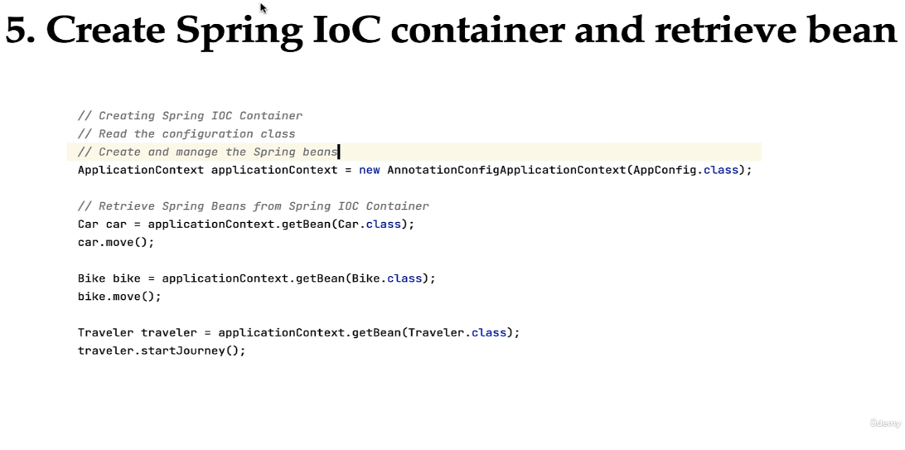
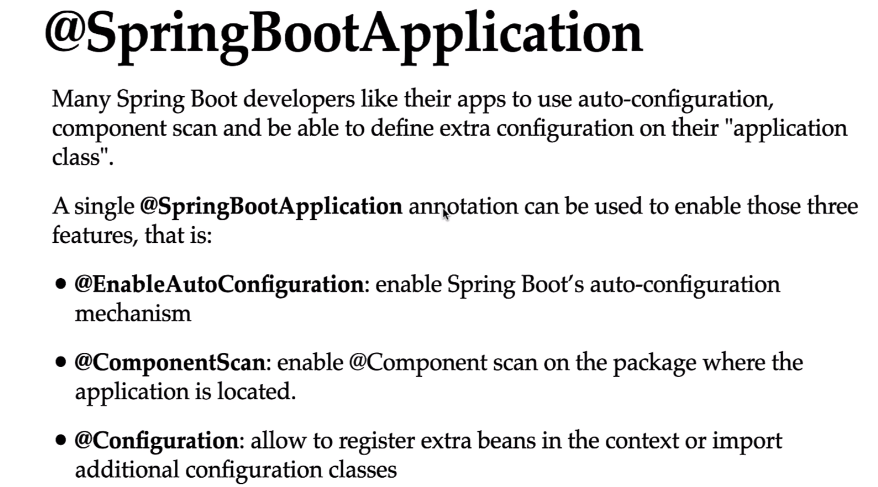
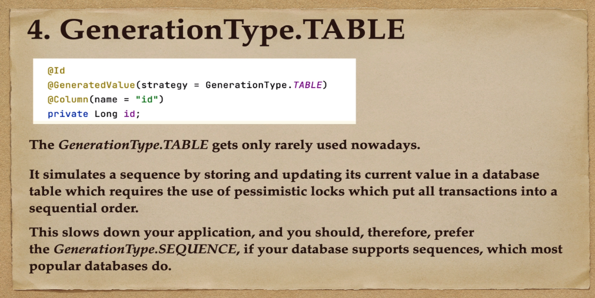
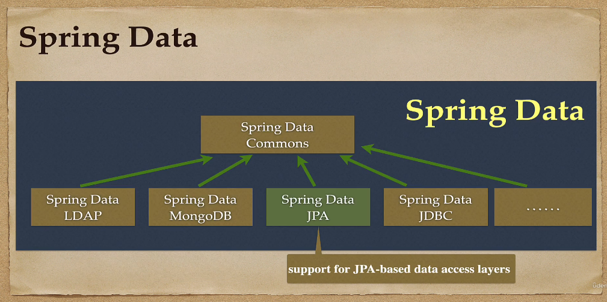

### SPRING BOOT HANDBOOK WITH PHUQUOCCHAMP

#### COURSES LINKS

- [[NEW] Master Spring Boot 3 &amp; Spring Framework 6 with Java](https://iqbusiness.udemy.com/course/spring-boot-and-spring-framework-tutorial-for-beginners/)
- [[NEW] Spring Boot 3, Spring 6 &amp; Hibernate for Beginners](https://iqbusiness.udemy.com/course/spring-hibernate-tutorial/)

#### Một số nội dung cần nắm:

##### Java Core

###### Concurrency

##### Spring & Spring Boot

Spring boot là một framework sử dụng spring behind the sence (việc sử dụng spring boot sẽ giúp cho ta cấu hình, sử dụng spring một cách nhanh chóng và dễ dành hơn)

##### Start first

###### Tight Coupling & Loose Coupling

Trong lập trình Java, khái niệm **tight-coupling** (liên kết ràng buộc) ám chỉ mối quan hệ giữa các lớp (classes) quá chặt chẽ. Khi sử dụng tight-coupling, các lớp kết nối với nhau một cách mạnh mẽ, và sự thay đổi trong một lớp có thể ảnh hưởng đến toàn bộ hệ thống hoặc các lớp khác. Điều này có thể tạo ra sự phụ thuộc không mong muốn và làm cho mã nguồn trở nên khó bảo trì và mở rộng.

Ngược lại, **loose coupling** (liên kết lỏng) là cách để giảm bớt sự phụ thuộc giữa các lớp với nhau. Trong loose coupling, các lớp hoạt động độc lập và không biết gì về cấu trúc hoặc chi tiết triển khai của các lớp khác. Điều này tạo điều kiện thuận lợi cho việc mở rộng và bảo trì mã nguồn.


###### Lazy-Initialization


###### Java Based Configuration


###### Annotation Based Configuration





###### The Different Between Annotation Based & Java Based Configuration.


##### Spring Core

###### IOC (Inversion Of Control)

**Inversion of Control (IoC)** là một nguyên tắc lập trình, trong đó luồng điều khiển trong ứng dụng không được quyết định bởi ứng dụng mà được quyết định bởi một framework hoặc container bên ngoài.

IoC thường đi kèm với DI, nơi các dependency được quản lý và cung cấp bởi một framework hoặc container. Framework sẽ quản lý việc tạo và quản lý các đối tượng và phụ thuộc.

###### IoC Container

IoC Container trong spring boot gồm 2 interface :

- BeanFactory.
- ApplicatonContext

Về cơ bản ApplicationContext là phần mở rộng của BeanFactory với nhiều chức năng hơn. Điểm khác biệt rõ nhất là BeanFactory tạo các bean theo yêu cầu (Lazy Loading), còn ApplicationContext sẽ tạo tất cả các bean khi khởi động (Eager Loading)

[Tham Khảo Thêm](https://www.baeldung.com/spring-beanfactory-vs-applicationcontext)

###### Dependency Injection


**Dependency Injection (DI)** là một design pattern trong lập trình, giúp quản lý sự phụ thuộc (dependency) giữa các thành phần của ứng dụng. Trong DI, các module không giao tiếp trực tiếp với nhau mà thông qua giao diện (interface). Các module cấp thấp sẽ thực thi giao diện, và module cấp cao sẽ giao tiếp thông qua giao diện này.

Ví dụ: Để giao tiếp với cơ sở dữ liệu, chúng ta có thể sử dụng một giao diện `IDatabase`, và có hai module cấp thấp là `XMLDatabase` và `SQLDatabase` thực thi giao diện này. Module cấp cao, ví dụ như `CustomerBusiness`, sẽ sử dụng giao diện `IDatabase` để tương tác với cơ sở dữ liệu.

Điều quan trọng là việc khởi tạo các module cấp thấp sẽ được DI container thực hiện. Module cấp cao không cần biết về chi tiết cụ thể của các module cấp thấp.

**Có ba dạng chính của Dependency Injection:**


1. **Constructor Injection** : Dependency được tiêm vào thông qua constructor của lớp.

   
2. **Setter Injection** : Dependency được tiêm vào thông qua các phương thức setter.

   
3. **Interface Injection (Field Based)** : Lớp cần tiêm sẽ thực thi một giao diện (interface) chứa phương thức `inject`. Container sẽ tiêm các dependency vào lớp thông qua phương thức `inject` của giao diện.

   

   
4. Khi nào nên sử dụng

   

**Ưu điểm của Dependency Injection**

* Tách biệt giữa việc tạo đối tượng và việc sử dụng đối tượng, làm cho ứng dụng dễ dàng mở rộng và bảo trì.
* Tạo sự linh hoạt trong việc thay đổi các dependency mà không cần sửa đổi mã nguồn của các class sử dụng chúng.
* Dễ dàng kiểm thử với các mock object để tạo các bài kiểm tra đơn vị (unit tests).
* Cải thiện khả năng đọc và hiểu mã nguồn.

###### Spring bean


Trong Spring Framework, một **bean** là một đối tượng được quản lý bởi Spring Container. Bean đại diện cho các thành phần cụ thể của ứng dụng, chẳng hạn như các đối tượng Java (POJO), các thành phần được quản lý (managed components), hay các service. Các bean được tạo, cấu hình và quản lý bởi Spring Container, và chúng thường được sử dụng để triển khai các logic kinh doanh và các chức năng khác của ứng dụng.

Dưới đây là một số điểm quan trọng về Spring bean:

1. **Định nghĩa Bean**:

   - Bạn có thể định nghĩa bean bằng cách sử dụng các annotations như `@Component`, `@Service`, `@Repository`, `@Controller`, hoặc bằng cách sử dụng XML configuration.
2. **Cấu hình Bean trong XML**:

   - Trong cấu hình XML, bạn có thể sử dụng thẻ `<bean>` để định nghĩa bean. Ví dụ:
     ```xml
     <bean id="myBean" class="com.example.MyBean"/>
     ```
3. **Dependency Injection (DI)**:

   - Spring cung cấp các cơ chế Dependency Injection để inject các dependency vào bean. Dependency có thể được inject qua constructor, setter method, hoặc field.
4. **Scope của Bean**:

   - Scope xác định "phạm vi" hoặc "thời gian sống" của một bean. Các scope phổ biến bao gồm singleton (một bean duy nhất), prototype (mỗi lần yêu cầu bean tạo một instance mới), request, session, và global session.
5. **Initialization và Destruction Callbacks**:

   - Bạn có thể định nghĩa các phương thức để thực hiện các công việc initialization và destruction khi bean được tạo và khi nó bị hủy.

Dưới đây là một ví dụ đơn giản về cách sử dụng annotations để định nghĩa và cấu hình một bean:

```java
import org.springframework.stereotype.Component;

@Component  // Đánh dấu là một Spring bean
public class MyBean {
    // Các logic của bean
}
```

Trong trường hợp này, `MyBean` là một Spring bean, và khi bạn sử dụng `@ComponentScan` hoặc cấu hình tương tự, Spring Container sẽ tự động quét và đăng ký bean này. Sau đó, bạn có thể inject nó vào các thành phần khác trong ứng dụng của mình.

###### Bean Scope


Scope của bean trong Spring định nghĩa "phạm vi" hay "thời gian sống" của một bean trong container. Spring hỗ trợ nhiều loại scope để đáp ứng các yêu cầu khác nhau của ứng dụng. Dưới đây là một số loại scope phổ biến:

1. **Singleton Scope:**

   - Đây là scope mặc định trong Spring. Khi một bean được đặt ở singleton scope, Spring Container chỉ tạo ra một instance của bean đó và giữ lại nó trong suốt thời gian chạy của ứng dụng. Mọi lần yêu cầu bean đều nhận được tham chiếu đến instance duy nhất.

   ```java
   @Component
   public class MySingletonBean {
       // Các logic của bean
   }
   ```
2. **Prototype Scope:**

   - Đối với prototype scope, mỗi lần yêu cầu bean, Spring Container sẽ tạo ra một instance mới của bean. Điều này đảm bảo rằng mỗi lần yêu cầu, bạn nhận được một đối tượng mới.

   ```java
   @Component
   @Scope("prototype")
   public class MyPrototypeBean {
       // Các logic của bean
   }
   ```
3. **Request Scope:**

   - Đối với web ứng dụng, request scope chỉ định rằng mỗi HTTP request sẽ tạo ra một instance mới của bean. Đối với mỗi request, bạn nhận được một bean mới.

   ```java
   @Component
   @Scope(value = WebApplicationContext.SCOPE_REQUEST, proxyMode = ScopedProxyMode.TARGET_CLASS)
   public class MyRequestScopedBean {
       // Các logic của bean
   }
   ```
4. **Session Scope:**

   - Session scope giữ cho một instance của bean trong suốt thời gian sống của một HTTP session trong ứng dụng web.

   ```java
   @Component
   @Scope(value = WebApplicationContext.SCOPE_SESSION, proxyMode = ScopedProxyMode.TARGET_CLASS)
   public class MySessionScopedBean {
       // Các logic của bean
   }
   ```
5. **Global Session Scope:**

   - Tương tự như session scope, nhưng được sử dụng trong môi trường Portlet, không phải Servlet.

   ```java
   @Component
   @Scope(value = WebApplicationContext.SCOPE_GLOBAL_SESSION, proxyMode = ScopedProxyMode.TARGET_CLASS)
   public class MyGlobalSessionScopedBean {
       // Các logic của bean
   }
   ```
6. **Application Scope:**

   - Application scope giữ cho một instance của bean trong suốt thời gian sống của ứng dụng web.

   ```java
   @Component
   @Scope(WebApplicationContext.SCOPE_APPLICATION)
   public class MyApplicationScopedBean {
       // Các logic của bean
   }
   ```

Mỗi loại scope phù hợp với các tình huống sử dụng cụ thể, và lựa chọn scope cần phải dựa trên yêu cầu và quyết định thiết kế của ứng dụng.

###### Bean Lifecycle


###### @Bean vs @Component

Điều đầu tiên mình nghỉ đến đó là có *@Component* là có thể tạo bean ngon lành cành đào rồi, thế sao lại phải sinh ra *@Bean* annotation chi nữa vậy ta?

Điều đầu tiên đó* @Bean* được sử dụng cho các hàm thay vì class như  *@Component* , [hàm](https://shareprogramming.net//ham-trong-java/) này sẽ trả về một [object](https://shareprogramming.net//object-va-class-trong-java/) sẽ được đăng ký và quản lý bởi Spring IoC container.

Bạn có thể sử dụng* @Bean* trong trường hợp bạn đang sử dụng các class thư viện bên thứ ba, lúc này bạn không thể khai báo *@Component* trên những class này mà bắt buộc bạn phải tạo một method trả về các instance của chúng và được chú thích bởi *@Bean* annotation.

Bạn phải sử dụng *@Bean* trong các* @Configuration* class để Spring có thể quét và khởi tạo các bean được khai báo bên trong.

```java
class UserService {
    @Autowired
    private PasswordEncoder passwordEncoder 

    public String createUser(UserCreateReq req) {
        UserEntity user = UserEntity.builder()
                            .setPassword(this.encoder.encode(req.getPassword()))
                            …
                            .build();
        repo.save(user);
    }
} 

@Configuration
class PasswordEncoderConfiguration {
    @Bean
    public PasswordEncoder passwordEncoder () {
        return new BCryptPasswordEncoder();
```

Trong ví dụ trên, mình đã sử dụng *BCryptPasswordEncoder* bởi thư viện bên thứ 3, chính vì thế mình phải sử dụng  *bCryptPasswordEncoder(* ) để khởi tạo một bean và đăng ký nó với Spring IoC.

###### Spring Container

Trong Spring Framework, một **Spring Container** là một môi trường chứa và quản lý các thành phần (components) của ứng dụng, chẳng hạn như các đối tượng (beans) và các thành phần khác. Container chịu trách nhiệm khởi tạo, cấu hình và quản lý vòng đời của các đối tượng trong ứng dụng.

Có hai loại container chính trong Spring:

1. **BeanFactory Container**: Đây là container cơ bản nhất. Nó thực hiện nhiệm vụ cơ bản của một container, bao gồm quản lý vòng đời của các bean và cung cấp các tính năng cơ bản như dependency injection. BeanFactory Container được sử dụng chủ yếu cho các ứng dụng có yêu cầu tài nguyên hạn chế và muốn tối ưu hóa việc sử dụng bộ nhớ.
2. **ApplicationContext Container**: Đây là một mức cao hơn của BeanFactory Container và cung cấp nhiều tính năng mở rộng. ApplicationContext cung cấp các tính năng như sự kiện (events), quản lý transaction, quản lý security, quản lý các property files, quản lý internationalization, và nhiều tính năng khác. ApplicationContext được sử dụng phổ biến hơn trong các ứng dụng do độ mạnh mẽ và khả năng tích hợp nhiều tính năng.

Cách mà bạn khai báo và cấu hình các bean được quản lý bởi container thường là thông qua các annotation (`@Component`, `@Service`, `@Repository`, `@Controller`,...) hoặc thông qua cấu hình XML.

Dưới đây là một ví dụ đơn giản về cách bạn có thể sử dụng ApplicationContext Container trong Spring:

```java
import org.springframework.context.ApplicationContext;
import org.springframework.context.annotation.AnnotationConfigApplicationContext;

public class MyApp {
    public static void main(String[] args) {
        // Tạo và cấu hình ApplicationContext từ class cấu hình
        ApplicationContext context = new AnnotationConfigApplicationContext(AppConfig.class);

        // Lấy bean từ container
        MyService myService = context.getBean(MyService.class);

        // Sử dụng bean
        myService.doSomething();
    }
}
```

Trong ví dụ trên, `AppConfig` là một class cấu hình của Spring, được đánh dấu bằng `@Configuration`, và nó chứa các định nghĩa bean. `AnnotationConfigApplicationContext` được sử dụng để tạo ApplicationContext từ cấu hình thông qua các annotation. Sau đó, bạn có thể lấy các bean từ container và sử dụng chúng trong ứng dụng của mình.

###### Component Scan

Trong Spring Framework, `@ComponentScan` là một annotation được sử dụng để chỉ định các package mà Spring Container nên quét để tìm các bean cần đăng ký. Khi bạn đánh dấu một package với `@ComponentScan`, Spring sẽ tự động tìm kiếm các class được đánh dấu với các annotations như `@Component`, `@Service`, `@Repository`, `@Controller`, và các annotations khác. Sau đó, nó sẽ tạo và đăng ký các bean tương ứng trong container.

Ví dụ, giả sử bạn có một ứng dụng Spring và bạn muốn quét package `com.example` để tìm và đăng ký các bean. Bạn có thể sử dụng `@ComponentScan` như sau:

```java
@Configuration
@ComponentScan("com.example")
public class AppConfig {
    // Các cài đặt khác của ứng dụng
}
```

Trong ví dụ trên:

- `@Configuration`: Đánh dấu một class là một cấu hình của Spring.
- `@ComponentScan("com.example")`: Chỉ định package mà Spring nên quét để tìm các bean.

Khi ứng dụng được khởi chạy, Spring sẽ tự động quét các class trong package `com.example` và các sub-packages của nó để tìm và đăng ký các bean.

Ngoài ra, bạn cũng có thể chỉ định nhiều packages hoặc sử dụng thuộc tính `basePackages` để chỉ định một danh sách các packages.

```java
@Configuration
@ComponentScan(basePackages = {"com.example.package1", "com.example.package2"})
public class AppConfig {
    // Các cài đặt khác của ứng dụng
}
```

Điều này giúp quản lý và tổ chức mã nguồn của bạn, đồng thời giúp Spring tự động quét và đăng ký các bean mà không cần phải thêm cấu hình rườm rà.

###### Lazy Initialization

Trong Spring Framework, "lazy initialization" là một khái niệm được sử dụng để chỉ ra rằng một bean nên được tạo ra chỉ khi nó thực sự được yêu cầu, thay vì tạo ra ngay từ khi Spring Container khởi chạy. Điều này giúp giảm thời gian khởi tạo ứng dụng và tối ưu hóa tài nguyên bằng cách trì hoãn việc tạo bean cho đến khi nó cần thiết.

##### Annotation

Annotation (chú thích) là một tính năng quan trọng trong lập trình Java, cho phép bạn thêm các thông tin bổ sung vào mã nguồn của bạn, giúp trình biên dịch và các công cụ phát triển hiểu và xử lý mã nguồn của bạn một cách thông minh. Annotation được sử dụng rộng rãi trong Java để đánh dấu và cung cấp metadata cho các lớp, phương thức, biến, hoặc gói.

Annotation không ảnh hưởng đến hoạt động chương trình khi chạy, nhưng chúng mang thông tin quan trọng về cấu trúc và mục đích của mã nguồn. Điều này có lợi cho việc tự động hóa các tác vụ, kiểm tra mã nguồn, và cung cấp hướng dẫn cho các công cụ phát triển.

###### Cú Pháp Cơ Bản của Annotation

Annotation trong Java được đặt trong một dấu `@`, theo sau là tên của annotation. Một số annotation có thể có giá trị được đặt trong dấu ngoặc đơn `(value = ...)`, nhưng nếu chỉ có một giá trị và không cần gán tên, bạn có thể viết trực tiếp giá trị đó.

Dưới đây là cú pháp cơ bản của annotation:

```java
@AnnotationName
@AnnotationName(value = "someValue")
```

###### Ví dụ về Annotation

**`@Override` **là một trong những annotation được sử dụng phổ biến nhất trong Java. Nó được đặt trên một phương thức để thông báo rằng phương thức này ghi đè (override) một phương thức từ lớp cha. Điều này giúp trình biên dịch kiểm tra xem phương thức thực sự có ghi đè một phương thức từ lớp cha hay không.

```java
class Animal {
    void makeSound() {
        System.out.println("Animal makes a sound");
    }
}

class Dog extends Animal {
    @Override
    void makeSound() {
        System.out.println("Dog barks");
    }
}


```

**`@Deprecated` **được sử dụng để đánh dấu một phần của mã nguồn hoặc một phương thức đã bị lỗi thời hoặc không nên sử dụng nữa. Nếu bạn sử dụng một phần được đánh dấu `@Deprecated`, trình biên dịch sẽ cảnh báo bạn về điều này.

```java
class OldLibrary {
    @Deprecated
    void oldMethod() {
        System.out.println("This method is deprecated.");
    }
}
```

**`@SuppressWarnings`** được sử dụng để tắt cảnh báo của trình biên dịch tại các vị trí cụ thể trong mã nguồn. Điều này có thể hữu ích khi bạn muốn tắt cảnh báo cụ thể mà bạn biết là không cần thiết.

```java
@SuppressWarnings("unused")
public class Example {
    int unusedVariable;

    @SuppressWarnings("deprecation")
    void useDeprecatedMethod() {
        OldLibrary library = new OldLibrary();
        library.oldMethod();
    }
}
```

###### **@Qualifier**

Trong Spring Framework, `@Qualifier` là một annotation được sử dụng để chỉ định tên của một bean cụ thể mà bạn muốn inject vào một dependency. Điều này là cần thiết khi có nhiều bean cùng loại được đăng ký trong container Spring và bạn muốn chỉ rõ bean nào sẽ được sử dụng.

Ví dụ, giả sử bạn có một interface `Person` và hai implementation của nó là `Student` và `Teacher`. Nếu bạn có một dependency kiểu `Person` và có nhiều bean cùng kiểu được đăng ký, bạn có thể sử dụng `@Qualifier` để xác định bean cụ thể mà bạn muốn sử dụng.

```java
public interface Person {
    // ...
}

@Component("studentBean")
public class Student implements Person {
    // ...
}

@Component("teacherBean")
public class Teacher implements Person {
    // ...
}

@Component
public class SomeClass {

    private final Person person;

    @Autowired
    public SomeClass(@Qualifier("studentBean") Person person) {
        this.person = person;
    }

    // ...
}
```

Trong ví dụ trên, `@Qualifier("studentBean")` được sử dụng để chỉ rõ rằng bạn muốn inject bean có tên là "studentBean" vào trường `person` của class `SomeClass`. Điều này giúp Spring biết được bean cụ thể nào cần được sử dụng khi có nhiều bean cùng kiểu được đăng ký.

> @Qualifier sẽ có độ ưu tiên cao hơn @primary.

###### @Primary

Trong Spring Framework, `@Primary` là một annotation được sử dụng để chỉ định rằng khi có nhiều bean cùng loại được đăng ký trong container, bean được đánh dấu là `@Primary` sẽ được ưu tiên chọn để inject.

Ví dụ, giả sử bạn có một interface `MessageService` và có nhiều implementation của nó. Bạn muốn một bean cụ thể được chọn mặc định khi có nhiều bean cùng loại. Bạn có thể sử dụng `@Primary` để làm điều này.

```java
public interface MessageService {
    String getMessage();
}

@Component
public class EmailService implements MessageService {
    @Override
    public String getMessage() {
        return "Email message";
    }
}

@Component
@Primary  // Đánh dấu là bean mặc định khi có nhiều bean cùng loại
public class SmsService implements MessageService {
    @Override
    public String getMessage() {
        return "SMS message";
    }
}
```

Trong ví dụ trên, `SmsService` được đánh dấu là `@Primary`, vì vậy khi bạn inject một bean của kiểu `MessageService` mà không chỉ định tên hoặc `@Qualifier`, Spring sẽ tự động chọn `SmsService` làm bean mặc định.

```java
@Service
public class MyService {
    private final MessageService messageService;

    // @Primary bean (SmsService) sẽ được inject tự động
    public MyService(MessageService messageService) {
        this.messageService = messageService;
    }
}
```

Nếu có nhiều bean cùng kiểu và không có `@Primary`, bạn có thể sử dụng `@Qualifier` để chỉ định rõ tên của bean bạn muốn inject.

###### @Controller, @Service @Responsive


#### Spring Boot


###### Spring Boot Auto Configuration





##### How Spring Boot Works Internally.


#### Spring Boot Rest API


#### Spring Data JPA

##### ORM


##### JPA


##### Hibernate


##### JPA vs Hibernate


##### Spring Data JPA


##### Hibernate vs Spring Data JPA


##### Basic Work Flow Of Spring Data JPA


##### Primary Key Generation Strategies




> Sự khác nhau giữa SEQUENCE và Table Generator là giá trị initialValue. Nếu là SEQUENCE nó sẽ lưu giá trị tiếp theo của dãy số vào table. Còn Table Generator sẽ lưu trữ giá trị cuối cùng đã được sử dụng vào table

##### Spring Data JPA Repository Interface



Repository Interface


##### Step To Create & Using Spring Data JPA


##### Spring Data JPA Details


###### save() Method => update retrieve entity


###### findByID() Method


###### saveAll() method


###### findAll() method


###### deleteById() method


###### delete() Method


###### deleteAll() Method


###### count() Method


###### exitByID() method


##### Một số câu lệnh CLI dùng với MySQL

###### Show databases;

```bash
show databases;
```

###### Chọn database;

```bash
 use <database name> ;
```

###### Xem cấu trúc của một table trong database;

```bash
describe <database table> ;
```

###### Hiển thị các bảng của database;

```bash
show tables;
```

###### Xóa bảng

```bash
drop table <table name>;
```

#### Build A CRUD RESTAPIs


#### ORM JPA vs Hibernate

Hibernate và JPA (Java Persistence API) là hai công nghệ phổ biến được sử dụng trong Java để làm việc với cơ sở dữ liệu quan hệ. Dưới đây là một số điểm quan trọng về mỗi công nghệ:

### Hibernate:

1. **Định nghĩa:**

   - Hibernate là một framework ORM (Object-Relational Mapping) cho Java. Nó cung cấp một cách tiện lợi để ánh xạ đối tượng Java vào các bảng trong cơ sở dữ liệu quan hệ.
2. **ORM:**

   - Hibernate giúp ánh xạ các đối tượng Java sang các bảng trong cơ sở dữ liệu và ngược lại, giảm bớt sự phức tạp của việc làm việc với SQL và cơ sở dữ liệu.
3. **Configuration:**

   - Hibernate yêu cầu cấu hình thông qua tệp cấu hình XML hoặc thông qua các annotations trên các đối tượng Java.
4. **API Mạnh Mẽ:**

   - Hibernate cung cấp một API mạnh mẽ cho các thao tác cơ sở dữ liệu như lấy dữ liệu, thêm mới, cập nhật và xóa.
5. **Query Language:**

   - Hibernate sử dụng HQL (Hibernate Query Language) là một ngôn ngữ truy vấn giống SQL để truy vấn cơ sở dữ liệu.

### JPA (Java Persistence API):

1. **Định nghĩa:**

   - JPA là một API chuẩn hóa do Java EE (Enterprise Edition) định rõ để làm việc với cơ sở dữ liệu quan hệ trong môi trường Java.
2. **ORM:**

   - JPA cung cấp một tiêu chuẩn ORM để ánh xạ các đối tượng Java vào cơ sở dữ liệu.
3. **Standardization:**

   - JPA là một phần của Java EE và được định rõ thông qua một loạt các interfaces và annotations, giúp đảm bảo tính di động và chuyển đổi giữa các nhà cung cấp JPA khác nhau.
4. **Configuration:**

   - JPA cũng yêu cầu cấu hình thông qua annotations trên các đối tượng Java, và thông thường sử dụng một cấu hình cụ thể của nhà cung cấp JPA.
5. **Nhà Cung Cấp JPA:**

   - JPA không phải là một implementation cụ thể mà là một chuẩn, và để sử dụng nó, bạn cần một implementation của JPA như Hibernate, EclipseLink, OpenJPA, và nhiều cái khác.

### Kết Hợp Hibernate và JPA:

- Hibernate thường được sử dụng như là một implementation cụ thể của JPA. Nghĩa là, bạn có thể sử dụng JPA annotations để ánh xạ các đối tượng và sử dụng Hibernate làm implementation để thực hiện các chức năng ORM cụ thể.
- Sự kết hợp giữa Hibernate và JPA giúp đảm bảo sự linh động và di động giữa các nhà cung cấp JPA khác nhau mà không làm mất đi sức mạnh và tính linh hoạt của Hibernate.
